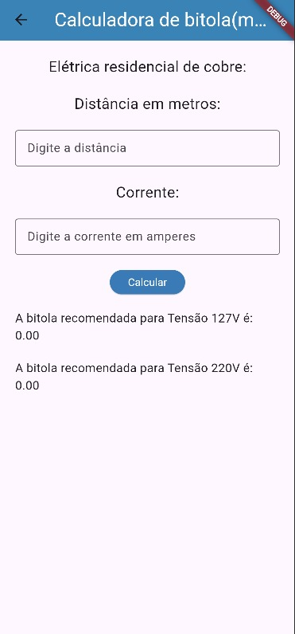
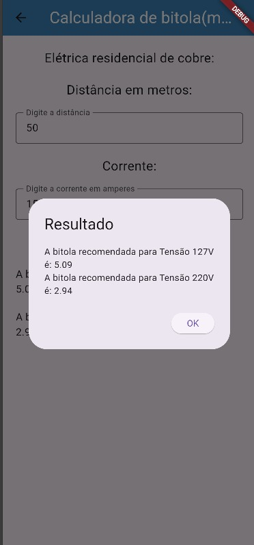
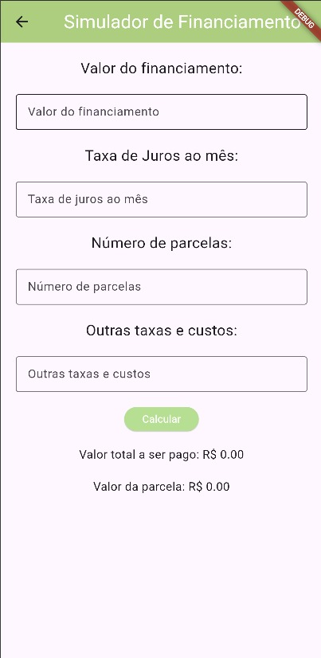
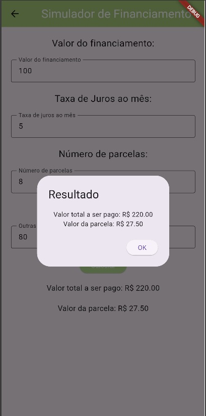
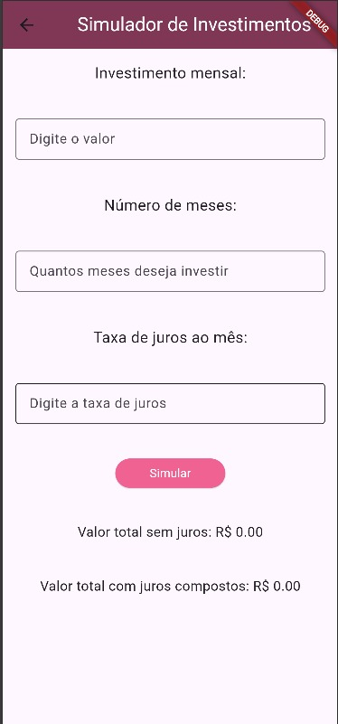

# 📱 Apps em Flutter

Este repositório reúne três aplicativos desenvolvidos em Flutter para fins educacionais.

---

## 🚆 Bitola Flutter 2026

### 🛠 Tecnologias
- Flutter

### ▶️ Como executar o projeto
1. Clone este repositório.
2. Abra o projeto no VS Code.
3. Instale as dependências:
   ```bash
   flutter pub get
   ```
4. Execute o aplicativo:
   ```bash
   flutter run
   ```
### 🖼 Pictures




---

## 💰 Investe Flutter 2026

### 🛠 Tecnologias
- Flutter

### ▶️ Como executar o projeto
1. Clone este repositório.
2. Abra o projeto no VS Code.
3. Instale as dependências:
   ```bash
   flutter pub get
   ```
4. Execute o aplicativo:
   ```bash
   flutter run
   ```

### 🖼 Pictures




---

## 📊 Juros Flutter 2026

### 🛠 Tecnologias
- Flutter

### ▶️ Como executar o projeto
1. Clone este repositório.
2. Abra o projeto no VS Code.
3. Instale as dependências:
   ```bash
   flutter pub get
   ```
4. Execute o aplicativo:
   ```bash
   flutter run
   ```

### 🖼 Pictures




---

👩🏻‍💻 Desenvolvido por Maria Eduarda Urbano
